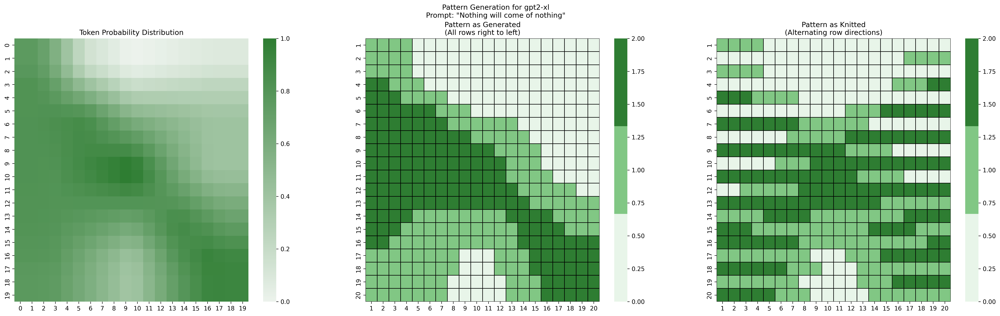
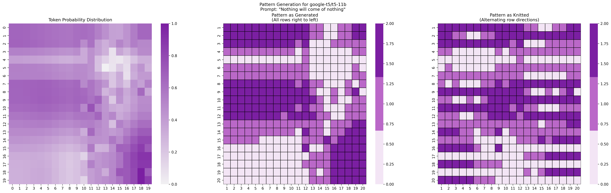

# Knitting LLMs: Generating Knitting Patterns from Language Models

This project explores the fascinating intersection of artificial intelligence and traditional crafts by generating knitting patterns from the internal representations of various language models. By analyzing the attention patterns, token probabilities, and hidden states of different language models, we create unique, model-specific knitting patterns that represent how these AI models process and understand text.

## Overview

The project takes a language model and a text prompt as input, and generates:
1. A visualization of the model's internal representations
2. A corresponding knitting pattern with three colors
3. Detailed knitting instructions in markdown format


*Example pattern generated from GPT-2 XL with the prompt "Nothing will come of nothing"*

## Features

- Supports multiple language model architectures (BERT, GPT-2, T5, GPT-J, BLOOM, LLaMA 2, Falcon)
- Generates unique color schemes for each model family
- Provides both visual patterns and written knitting instructions
- Creates 20x20 stitch patterns suitable for small projects
- Includes difficulty ratings based on pattern complexity
- Outputs both probability distributions and final knitting patterns

## Installation

```bash
# Clone the repository
git clone https://github.com/yourusername/knitting-llms.git
cd knitting-llms

# Create a virtual environment and install dependencies
python -m venv venv
source venv/bin/activate  # On Windows: venv\Scripts\activate
pip install -r requirements.txt
```

## Usage

Run the main script with Python:

```bash
python output_diversity.py
```

This will generate patterns for all supported models using various Shakespeare quotes as prompts. The outputs will be saved in the `outputs/` directory, including:
- PNG visualizations of the patterns
- Markdown files with detailed knitting instructions
- Color scheme information and difficulty ratings

## Supported Models

The project currently supports the following language models:
- BERT (bert-base-uncased)
- GPT-2 XL
- T5-11B
- GPT-J 6B
- BLOOM 7B1
- LLaMA 2 13B
- Falcon 7B

Each model generates patterns with its own distinctive color scheme, reflecting its unique architecture and training.

## Model Selection and Technical Details

The models were carefully chosen to represent key milestones in the evolution of language models, while ensuring they can run on consumer hardware (specifically, an NVIDIA RTX 4090 with 24GB VRAM):

### BERT (bert-base-uncased) - 2018
- **Architecture**: Transformer encoder with bidirectional context
- **Parameters**: 110 million
- **Historical Significance**: Revolutionized NLP by introducing bidirectional context and masked language modeling
- **VRAM Usage**: ~1GB in FP32 (very efficient)
- **Color Scheme**: Blues, representing its foundational nature

### GPT-2 XL - 2019
- **Architecture**: Transformer decoder-only (causal language model)
- **Parameters**: 1.5 billion
- **Historical Significance**: First model to demonstrate high-quality text generation without task-specific training
- **VRAM Usage**: ~16GB in FP32, ~8GB in FP16
- **Color Scheme**: Greens, symbolizing growth in generative capabilities

### T5-11B - 2019
- **Architecture**: Encoder-decoder Transformer
- **Parameters**: 11 billion
- **Historical Significance**: Pioneered the "text-to-text" framework for unified task handling
- **VRAM Usage**: Requires optimization (8-bit quantization) for 24GB cards
- **Color Scheme**: Purples, representing its versatile nature

### GPT-J 6B - 2021
- **Architecture**: Transformer decoder with rotary positional embeddings
- **Parameters**: 6 billion
- **Historical Significance**: First major open-source alternative to GPT-3
- **VRAM Usage**: ~12GB in FP16
- **Color Scheme**: Oranges, reflecting its open-source warmth

### BLOOM 7B1 - 2022
- **Architecture**: Transformer decoder-only
- **Parameters**: 7.1 billion
- **Historical Significance**: First large-scale multilingual model (46 languages)
- **VRAM Usage**: ~14GB in FP16
- **Color Scheme**: Pinks, symbolizing its inclusive design

### LLaMA 2 13B - 2023
- **Architecture**: Transformer decoder-only with optimized attention
- **Parameters**: 13 billion
- **Historical Significance**: State-of-the-art open model with commercial usage rights
- **VRAM Usage**: Requires 8-bit quantization for 24GB cards
- **Color Scheme**: Deep Oranges, representing its advanced capabilities

### Falcon 7B - 2023
- **Architecture**: Transformer decoder-only with FlashAttention
- **Parameters**: 7 billion
- **Historical Significance**: Top-performing truly open-source model under Apache 2.0 license
- **VRAM Usage**: ~15GB in FP16
- **Color Scheme**: Light Greens, symbolizing its efficient design

This selection spans five years of NLP progress (2018-2023) and showcases the evolution from smaller, specialized models (BERT) to larger, more capable generalists (LLaMA 2, Falcon). Each model brings unique architectural innovations and historical significance, while remaining practical for consumer hardware through various optimization techniques like half-precision (FP16) and 8-bit quantization.

## How It Works

The pattern generation process involves:

1. **Model Analysis**: Extract internal representations from the language model:
   - Token probabilities
   - Attention patterns
   - Hidden state interactions

2. **Pattern Creation**: Combine these representations to create a 20x20 knitting pattern:
   - Convert probabilities into color intensities
   - Map attention patterns to stitch placement
   - Use layer interactions for pattern complexity

3. **Instruction Generation**: Create detailed knitting instructions:
   - Row-by-row color changes
   - Stitch counts and transitions
   - Difficulty assessment
   - Color scheme information

## Example Output

Here's an example of a pattern generated from T5-11B:


*Pattern generated from T5-11B with the prompt "Nothing will come of nothing"*

Each pattern comes with detailed knitting instructions in a markdown file, including:
- Color scheme with hex codes
- Row-by-row instructions
- Stitch counts and color changes
- Tips for successful execution

## Requirements

- Python 3.8+
- PyTorch
- Transformers (Hugging Face)
- Matplotlib
- Seaborn
- NumPy
- At least 24GB GPU VRAM for larger models
- 16GB+ RAM

## Contributing

Contributions are welcome! Please feel free to submit a Pull Request. Areas for improvement include:
- Adding support for more language models
- Implementing additional pattern generation techniques
- Improving the knitting instruction format
- Adding new prompts or text inputs

## License

This project is licensed under the MIT License - see the LICENSE file for details.

## Acknowledgments

- The Hugging Face team for their excellent Transformers library
- The creators and researchers behind the supported language models
- The knitting community for inspiration and pattern design principles 
