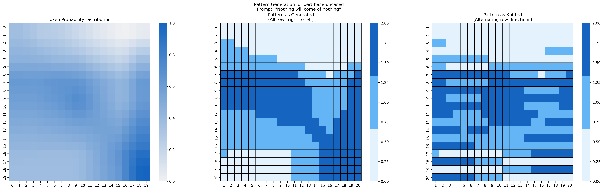

# Knitting Pattern Generated from bert-base-uncased

## Pattern Information
- **Model**: bert-base-uncased
- **Prompt**: "Nothing will come of nothing"
- **Size**: 20x20 stitches
- **Difficulty**: Beginner

## Materials
- Yarn in three colors (see color scheme below)
- Knitting needles appropriate for your chosen yarn
- Stitch markers (optional)
- Row counter (recommended)
- Tapestry needle for weaving in ends

## Gauge
- Gauge is not critical for this pattern, but aim for:
- 20-22 stitches and 28-30 rows = 4 inches (10 cm) in stockinette stitch
- Use needle size appropriate for your chosen yarn to achieve a fabric you like

## Color Scheme
- Color 1: Light Blue (#E3F2FD)
- Color 2: Medium Blue (#64B5F6)
- Color 3: Dark Blue (#1565C0)

## Pattern Notes
- Each row is read from left to right
- The pattern is worked in stockinette stitch unless otherwise specified
- Carry unused colors loosely along the back of work
- Check gauge and adjust needle size accordingly
- For best results, always work a gauge swatch before starting

## Row-by-Row Instructions

### Row 1
Work as follows: Color 1 (Light Blue) for 20 stitches

### Row 2
Work as follows: Color 1 (Light Blue) for 20 stitches

### Row 3
Work as follows: Color 2 (Medium Blue) for 2 stitches | Color 1 (Light Blue) for 18 stitches

### Row 4
Work as follows: Color 2 (Medium Blue) for 4 stitches | Color 1 (Light Blue) for 16 stitches

### Row 5
Work as follows: Color 2 (Medium Blue) for 8 stitches | Color 1 (Light Blue) for 12 stitches

### Row 6
Work as follows: Color 2 (Medium Blue) for 12 stitches | Color 1 (Light Blue) for 6 stitches | Color 2 (Medium Blue) for 2 stitches

### Row 7
Work as follows: Color 3 (Dark Blue) for 11 stitches | Color 2 (Medium Blue) for 4 stitches | Color 1 (Light Blue) for 1 stitches | Color 2 (Medium Blue) for 3 stitches | Color 3 (Dark Blue) for 1 stitches

### Row 8
Work as follows: Color 3 (Dark Blue) for 12 stitches | Color 2 (Medium Blue) for 6 stitches | Color 3 (Dark Blue) for 2 stitches

### Row 9
Work as follows: Color 3 (Dark Blue) for 13 stitches | Color 2 (Medium Blue) for 5 stitches | Color 3 (Dark Blue) for 2 stitches

### Row 10
Work as follows: Color 3 (Dark Blue) for 13 stitches | Color 2 (Medium Blue) for 5 stitches | Color 3 (Dark Blue) for 2 stitches

### Row 11
Work as follows: Color 3 (Dark Blue) for 13 stitches | Color 2 (Medium Blue) for 5 stitches | Color 3 (Dark Blue) for 2 stitches

### Row 12
Work as follows: Color 2 (Medium Blue) for 5 stitches | Color 3 (Dark Blue) for 8 stitches | Color 2 (Medium Blue) for 4 stitches | Color 3 (Dark Blue) for 3 stitches

### Row 13
Work as follows: Color 2 (Medium Blue) for 8 stitches | Color 3 (Dark Blue) for 6 stitches | Color 2 (Medium Blue) for 2 stitches | Color 3 (Dark Blue) for 4 stitches

### Row 14
Work as follows: Color 2 (Medium Blue) for 12 stitches | Color 3 (Dark Blue) for 3 stitches | Color 2 (Medium Blue) for 1 stitches | Color 3 (Dark Blue) for 4 stitches

### Row 15
Work as follows: Color 2 (Medium Blue) for 13 stitches | Color 3 (Dark Blue) for 7 stitches

### Row 16
Work as follows: Color 2 (Medium Blue) for 14 stitches | Color 3 (Dark Blue) for 6 stitches

### Row 17
Work as follows: Color 2 (Medium Blue) for 1 stitches | Color 1 (Light Blue) for 9 stitches | Color 2 (Medium Blue) for 4 stitches | Color 3 (Dark Blue) for 6 stitches

### Row 18
Work as follows: Color 1 (Light Blue) for 10 stitches | Color 2 (Medium Blue) for 4 stitches | Color 3 (Dark Blue) for 6 stitches

### Row 19
Work as follows: Color 1 (Light Blue) for 10 stitches | Color 2 (Medium Blue) for 4 stitches | Color 3 (Dark Blue) for 6 stitches

### Row 20
Work as follows: Color 1 (Light Blue) for 10 stitches | Color 2 (Medium Blue) for 4 stitches | Color 3 (Dark Blue) for 6 stitches

## Tips
- Use stitch markers between color changes to help track your progress
- Weave in ends as you go to minimize finishing work
- Block your finished piece to even out the stitches
- Take a picture of each row as you complete it to track your progress
- Consider using bobbins for each color to prevent tangling

## Pattern Visualization
