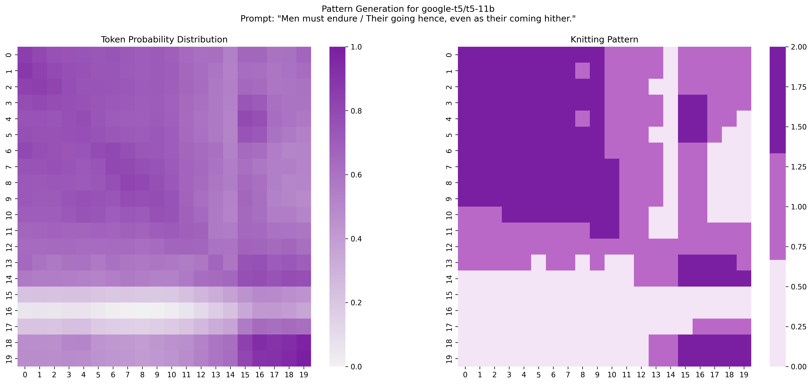

# Knitting Pattern Generated from google-t5/t5-11b

## Pattern Information
- **Model**: google-t5/t5-11b
- **Prompt**: "Men must endure / Their going hence, even as their coming hither."
- **Size**: 20x20 stitches
- **Difficulty**: Intermediate

## Materials
- Yarn in three colors (see color scheme below)
- Knitting needles appropriate for your chosen yarn
- Stitch markers (optional)
- Row counter (recommended)
- Tapestry needle for weaving in ends

## Gauge
- Gauge is not critical for this pattern, but aim for:
- 20-22 stitches and 28-30 rows = 4 inches (10 cm) in stockinette stitch
- Use needle size appropriate for your chosen yarn to achieve a fabric you like

## Color Scheme
- Color 1: Light Purple (#F3E5F5)
- Color 2: Medium Purple (#BA68C8)
- Color 3: Dark Purple (#7B1FA2)

## Pattern Notes
- Pattern is worked flat (back and forth)
- Odd-numbered rows (right side): Work from right to left
- Even-numbered rows (wrong side): Work from left to right
- The pattern is worked in stockinette stitch unless otherwise specified
- Carry unused colors loosely along the back of work
- Check gauge and adjust needle size accordingly
- For best results, always work a gauge swatch before starting

## Row-by-Row Instructions

### Row 1
Work right to left as follows: Color 3 (Dark Purple) for 10 stitches | Color 2 (Medium Purple) for 4 stitches | Color 1 (Light Purple) for 1 stitches | Color 2 (Medium Purple) for 5 stitches

### Row 2
Work left to right as follows: Color 2 (Medium Purple) for 5 stitches | Color 1 (Light Purple) for 1 stitches | Color 2 (Medium Purple) for 4 stitches | Color 3 (Dark Purple) for 1 stitches | Color 2 (Medium Purple) for 1 stitches | Color 3 (Dark Purple) for 8 stitches

### Row 3
Work right to left as follows: Color 3 (Dark Purple) for 10 stitches | Color 2 (Medium Purple) for 3 stitches | Color 1 (Light Purple) for 2 stitches | Color 2 (Medium Purple) for 5 stitches

### Row 4
Work left to right as follows: Color 2 (Medium Purple) for 3 stitches | Color 3 (Dark Purple) for 2 stitches | Color 1 (Light Purple) for 1 stitches | Color 2 (Medium Purple) for 4 stitches | Color 3 (Dark Purple) for 10 stitches

### Row 5
Work right to left as follows: Color 3 (Dark Purple) for 8 stitches | Color 2 (Medium Purple) for 1 stitches | Color 3 (Dark Purple) for 1 stitches | Color 2 (Medium Purple) for 4 stitches | Color 1 (Light Purple) for 1 stitches | Color 3 (Dark Purple) for 2 stitches | Color 2 (Medium Purple) for 2 stitches | Color 1 (Light Purple) for 1 stitches

### Row 6
Work left to right as follows: Color 1 (Light Purple) for 2 stitches | Color 2 (Medium Purple) for 1 stitches | Color 3 (Dark Purple) for 2 stitches | Color 1 (Light Purple) for 2 stitches | Color 2 (Medium Purple) for 3 stitches | Color 3 (Dark Purple) for 10 stitches

### Row 7
Work right to left as follows: Color 3 (Dark Purple) for 10 stitches | Color 2 (Medium Purple) for 4 stitches | Color 1 (Light Purple) for 1 stitches | Color 2 (Medium Purple) for 2 stitches | Color 1 (Light Purple) for 3 stitches

### Row 8
Work left to right as follows: Color 1 (Light Purple) for 3 stitches | Color 2 (Medium Purple) for 2 stitches | Color 1 (Light Purple) for 1 stitches | Color 2 (Medium Purple) for 3 stitches | Color 3 (Dark Purple) for 11 stitches

### Row 9
Work right to left as follows: Color 3 (Dark Purple) for 11 stitches | Color 2 (Medium Purple) for 3 stitches | Color 1 (Light Purple) for 1 stitches | Color 2 (Medium Purple) for 2 stitches | Color 1 (Light Purple) for 3 stitches

### Row 10
Work left to right as follows: Color 1 (Light Purple) for 3 stitches | Color 2 (Medium Purple) for 2 stitches | Color 1 (Light Purple) for 1 stitches | Color 2 (Medium Purple) for 3 stitches | Color 3 (Dark Purple) for 11 stitches

### Row 11
Work right to left as follows: Color 2 (Medium Purple) for 3 stitches | Color 3 (Dark Purple) for 8 stitches | Color 2 (Medium Purple) for 2 stitches | Color 1 (Light Purple) for 2 stitches | Color 2 (Medium Purple) for 2 stitches | Color 1 (Light Purple) for 3 stitches

### Row 12
Work left to right as follows: Color 2 (Medium Purple) for 5 stitches | Color 1 (Light Purple) for 2 stitches | Color 2 (Medium Purple) for 2 stitches | Color 3 (Dark Purple) for 2 stitches | Color 2 (Medium Purple) for 9 stitches

### Row 13
Work right to left as follows: Color 2 (Medium Purple) for 20 stitches

### Row 14
Work left to right as follows: Color 2 (Medium Purple) for 1 stitches | Color 3 (Dark Purple) for 4 stitches | Color 2 (Medium Purple) for 3 stitches | Color 1 (Light Purple) for 2 stitches | Color 2 (Medium Purple) for 1 stitches | Color 1 (Light Purple) for 1 stitches | Color 2 (Medium Purple) for 2 stitches | Color 1 (Light Purple) for 1 stitches | Color 2 (Medium Purple) for 5 stitches

### Row 15
Work right to left as follows: Color 1 (Light Purple) for 12 stitches | Color 2 (Medium Purple) for 3 stitches | Color 3 (Dark Purple) for 5 stitches

### Row 16
Work left to right as follows: Color 1 (Light Purple) for 20 stitches

### Row 17
Work right to left as follows: Color 1 (Light Purple) for 20 stitches

### Row 18
Work left to right as follows: Color 2 (Medium Purple) for 4 stitches | Color 1 (Light Purple) for 16 stitches

### Row 19
Work right to left as follows: Color 1 (Light Purple) for 13 stitches | Color 2 (Medium Purple) for 2 stitches | Color 3 (Dark Purple) for 5 stitches

### Row 20
Work left to right as follows: Color 3 (Dark Purple) for 5 stitches | Color 2 (Medium Purple) for 2 stitches | Color 1 (Light Purple) for 13 stitches

## Tips
- Use stitch markers between color changes to help track your progress
- Weave in ends as you go to minimize finishing work
- Block your finished piece to even out the stitches
- Take a picture of each row as you complete it to track your progress
- Consider using bobbins for each color to prevent tangling
- Remember that even-numbered rows are worked from left to right (wrong side)

## Pattern Visualization
